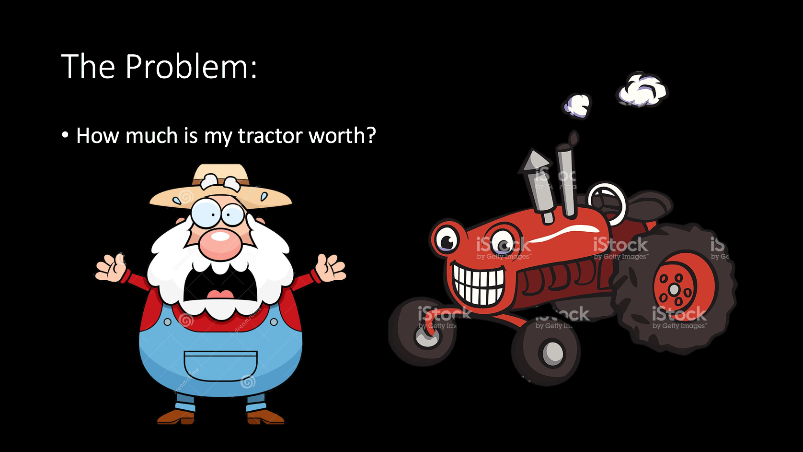
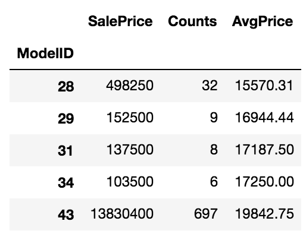

# Tractors

                
<strong> Goal: </strong> Predict the sale price of heavy equipment at auction.

<strong> Context: </strong> I worked on a team of three in competition with other classmates. My primary role was to write the code that predicted an item's auction price.

<strong> What tools did I use? </strong> I analyzed the data with python using pandas, numpy, and sklearn.

<strong> What was the big takeaway? </strong> The simplest model can be the best, and a little insight can go a long way.

 
<h2> Step 1: Get Average Sale Price By Model </h2>

Most groups built models based on features such as the item's age or engine size.
But we reasoned that the best predictor of price would be the price the same model sold for at previous
auctions. So if I wanted to know the price of a pinecone, it would be helpful to know that two previous pinecones sold for $4 and $5.

To implement this strategy, I create a new table that is indexed by model id and has columns of "SalePrice", "Counts", and "AvgPrice".

<pre><code>train_df['Counts'] = 1
avg_prices_df = train_df[['ModelID','SalePrice','Counts']].groupby('ModelID').sum()
avg_prices_df['AvgPrice'] = (avg_prices_df.SalePrice / avg_prices_df.Counts).round(2)</code></pre>

<em>Quick interpretation: The first row shows that if we consider items
with a model id of "28", thirty two were sold with total sales of $498,250, or about
$15,570 per item. So if I were to predict the price of another item with
a model id of 28, $15,570 is not a bad guess.</em>

 
<h2> Step 2: Create A Function That Predicts Sale Price By Simple Lookup </h2>

In order to make predictions, we need a function that looks up the predicted price.
Just in case an unseen model id shows up in the test set, we also need to calculate the
average price accross all items.

<pre><code>def predict_price(id):
    try: return avg_prices_df.loc[id]['AvgPrice']
    except: return avg_sale_price</code></pre>

 
<h2> Step 3: Use The Function To Predict Prices in the Test Data </h2>

The final step - use the "predict prices" function to predict prices
of unseen data, and score that model with the actual prices.

<pre><code>test_predicted_prices = test_df.ModelID.apply(predict_price)
score_gtap = score(test_predicted_prices, test_actual_prices)
print("The guess-the-average-price model has a RMLSE of {:.4}.".format(score_gtap))</code></pre>

This model earned a RMLSE of 0.3209. For
comparison, the next lowest score from my cohort was around .6, nearly twice my result.
  <em>Hurrah!</em>
  
(Side note, I have since replaced the .apply(predict_price) with a .map(avg_price_dictionary), which cut the time for this step down from over a minute to under a second.)

 
<h2> Step 4: Linear Regression </h2>
  <strong style="font-size: 18px">
Unfortuantely, this solution wasn't strictly legal. </strong>

By the terms of the competition, we were required to create a linear model. 
Luckily, this wasn't hard to do once I had the average price lookup table andfunction. 
In essence, we created another feature that was the "average price of that model" 
and then fit a linear model with just that one feature.

 
<h2> Summary </h2>

I was really proud that our method did so well. I've watched two more cohorts go through this case study
and so far no one has gotten near our results. 

I'd love to expand the model to include more featuers such as the age of the equiptment. 
One of the challenges of this data set was the large number of Nans, but I discoverd that if you split
the data by Product Group, the Nans almost dissappear. 

This makes sense, because different categories of equiptment have different features. For example, the size of the shovel is probably an important feature for a backhoe loader, but a motor grader doesn't have any shovel at all. The typical ways of dealing with this, for example filling in with the mean or median value, end up putting a digging tool on a flattening machine.
